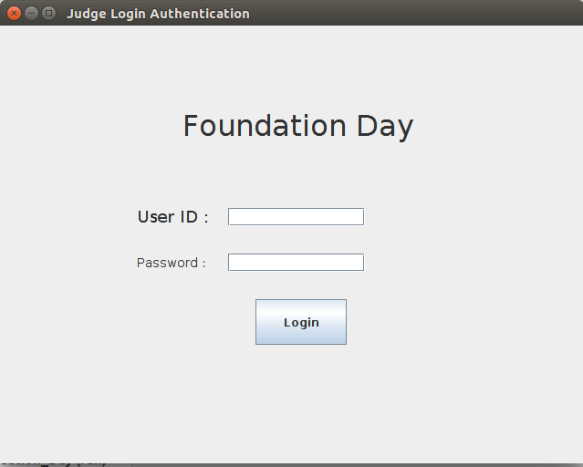

# GUI-for-FoundationDay
This is a GUI based software.

Screenshot of the GUI are also present for the understanding of the reader.

### Assignment: 3

## Problem Statement: 

Assume some institute wants to create a GUI which will be used to enter records regarding foundation
day schedule. The record will consist of
1. No of members in team, batch year, performance type, unique id for each performance.
2. Marks awarded by judges (3) to performance.

Any judge can login into the system using proper credential (login id and password) and update
information relevant to the record.

Now write a Java code to design such a GUI.

You can assume that
* a. Login id of a judge is his/her email id.
* b. Password is alphanumeric and string of length at least 7.

